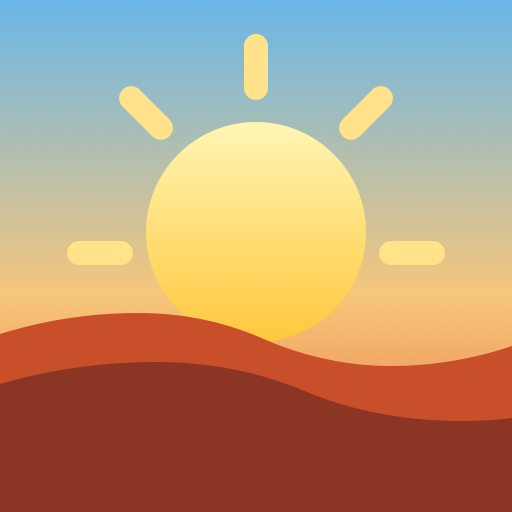

# Breakfast! AI

Breakfast is an Android app for a calmer morning dashboard. It brings together a few focused cards on one screen:

- Weather for your chosen city
- A latest-feed list from RSS or Atom sources you select
- An optional AI briefing that ranks and summarizes only the feeds you mark for it
- Social-app access controls for Instagram and LinkedIn
- Optional personal notes and a calendar overview

<div align="center">
  
</div>

## Current Features

- Weather card with current conditions, temperature, humidity, wind, and hourly rain forecast
- A latest-feed card that shows recent items from the feeds you include in that list
- An AI briefing card that ranks and summarizes recent items from the feeds you mark for AI
- Per-feed controls so a source can appear in the latest-feed list, the AI briefing, both, or neither
- Optional personal cards, including notes and a calendar overview
- Local caching for weather, feed items, AI briefing results, and personal notes
- A timed social-access window for Instagram and LinkedIn
- Accessibility-service-based distraction control after that window ends
- In-app article opening with Chrome Custom Tabs, with browser fallback
- Scheduled morning refresh with an optional "Breakfast is ready" notification
- Settings for city, feed sources, refresh behavior, social limits, and AI configuration

## How It Works

When the app opens:

1. It loads cached weather and feed data if available.
2. It fetches fresh weather for the configured city.
3. It fetches recent articles from your RSS or Atom feeds.
4. It fills the latest-feed card from the feeds selected for that list.
5. If AI is configured, it ranks and summarizes articles from the feeds selected for the AI briefing.
6. It shows the enabled cards on the main screen as a morning snapshot.
7. It can schedule a morning refresh and notify you when the dashboard is ready.

The social feature works as a timed access window. While the timer is active, the supported social apps open normally. After the timer ends, Breakfast uses its accessibility service to hide distracting parts of those apps so messages remain reachable while the rest is limited until the daily reset.

## Permissions

Breakfast currently uses these Android permissions:

- `INTERNET` for weather, feeds, and optional AI requests
- `READ_CALENDAR` for the optional calendar overview
- `POST_NOTIFICATIONS` for timer and dashboard notifications
- `FOREGROUND_SERVICE` for the social timer notification
- Accessibility service permission for social-app distraction control

The app also checks whether Instagram and LinkedIn are installed so it can open them from the social card.

## Privacy

Breakfast stores settings and cached content locally on-device.

Network requests are only made for the features you enable:

- Weather requests go to Open-Meteo
- Feed requests go to the RSS or Atom sources you add
- AI requests go to the configured OpenAI-compatible endpoint if you supply one

This repository does not include analytics or ad SDKs.

## Project Status

The current codebase is a practical prototype of the Breakfast dashboard rather than a polished finished product. Areas that still stand out:

- More polish and consistency across card copy and onboarding
- Stronger offline behavior for the most important morning content
- A more flexible card model for future modules

## Building

Breakfast depends on the `distractionlib` Android library from [kasnder/redd-focus-android](https://github.com/kasnder/redd-focus-android) for the social-app limiting features.

The current Gradle setup expects that library as a local sibling project:

- `settings.gradle` includes `:distractionlib`
- By default it resolves `:distractionlib` from `../GreaseMilkyway/distractionlib`

Basic local setup:

1. Clone this repository.
2. Clone [kasnder/redd-focus-android](https://github.com/kasnder/redd-focus-android) so its `distractionlib` module is available as a sibling directory.
3. Either place that checkout where this project expects it, or update `settings.gradle` to point `project(':distractionlib').projectDir` at your local `distractionlib` path.
4. Open the project in Android Studio or build from the command line.

Example:

```bash
git clone <this-repo>
git clone https://github.com/kasnder/redd-focus-android ../GreaseMilkyway
cd breakfast-app
./gradlew assembleDebug
```

Minimum SDK: 24

## Contributing

Contributions are welcome. Areas that would be especially useful:

- Improving feed parsing robustness
- Better article reading flows
- Background refresh and notification scheduling
- Personalizable modules for the main screen
- UX polish for the morning dashboard experience

## License

This project is licensed under the GNU General Public License v3.0. See [LICENSE](LICENSE).
